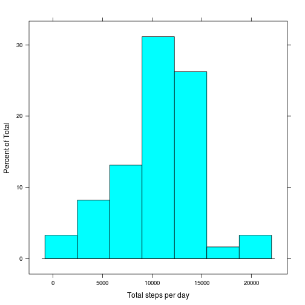

# Reproducible Research: Peer Assessment 1


## Loading and preprocessing the data

```r
unzip("activity.zip")
activity_df <- read.csv("activity.csv", colClasses=c('integer','Date','integer'), stringsAsFactors=FALSE)
DateFactor <- factor(activity_df$date)
activity_df = cbind(activity_df, DateFactor)
IntervalFactor <- factor(activity_df$interval)
activity_df = cbind(activity_df, IntervalFactor)
```

## What is mean total number of steps taken per day?

```r
library(lattice)
total_steps_per_day <- tapply(activity_df$steps, activity_df$DateFactor, sum)
histogram(total_steps_per_day, xlab="Total steps per day")
```

 

```r
hist(total_steps_per_day, main="Qty histogram (Base plotting system)", xlab="Total steps per day")
```

 

Here are mean & median values of total steps per day:

```r
mean(total_steps_per_day, na.rm=TRUE)
```

```
## [1] 10766
```

```r
median(total_steps_per_day, na.rm=TRUE)
```

```
## [1] 10765
```

## What is the average daily activity pattern?

```r
avg_steps_per_interval = tapply(activity_df$steps, activity_df$IntervalFactor, mean, na.rm=TRUE)
plot(levels(activity_df$IntervalFactor), avg_steps_per_interval, type="l", xlab="Interval ID", ylab="Steps count", main="Line plot (Base plotting system)")
```

 

Here are IntervalID and value of maximal average steps for time interval during the day:

```r
max_index <- which.max(avg_steps_per_interval)
avg_steps_per_interval[max_index]
```

```
##   835 
## 206.2
```

## Imputing missing values

Had no time to do this, sorry

## Are there differences in activity patterns between weekdays and weekends?

Had no time to do this, sorry
